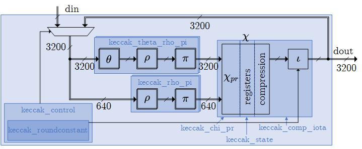
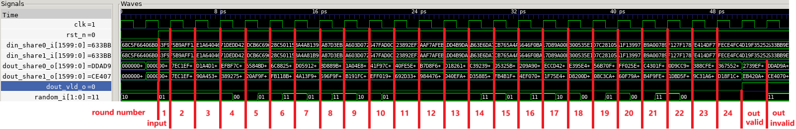

# Hardware Implementation of the Low-Latency First-Order Masked SHA-3  

**Table of Contents:**

- [Introduction](#introduction)
- [File Structure](#file-structure)
- [RTL Structure and Description](#rtl-structure-and-description)
  - [Module Structure](#module-structure)
  - [Port Description](#port-description)
  - [Timing Description](#timing-description)
- [Functional Simulation](#functional-simulation)
  - [Instructions on Functional Simulation](#instructions-on-functional-simulation)
  - [Output of Functional Simulation](#output-of-functional-simulation)
  - [Tested Environment](#tested-environment)
- [Synthesis](#synthesis)
  - [Instructions on Synthesis](#instructions-on-synthesis)
  - [Output of Synthesis](#output-of-synthesis)
  - [Modify Scripts](#modify-scripts)
- [Contact](#contact)
- [License](#license)

## Introduction

This directory contains the hardware implementation code for the article [Breaking Ground: A New Area Record for Low-Latency First-Order Masked SHA-3](). It implements a 2-share masked Keccak, which is proven in the article to be first-order glitch and register-transition robust probing secure. This implementation has the same latency (one round per cycle) as the unprotected round-based Keccak, occupies three times the area, and requires 2 fresh random bits per cycle. For considerations on integrating it into larger first-order circuits, please refer to the final section of the original paper.

Note: For a fair comparison with related works, we have implemented a Keccak core that performs one permutation at a time. Modifying it to support the full SHA-3 functionality should be relatively straightforward, requiring adjustments to the control module and input handling.

## File Structure

- `.\src_rtl\*.v`: All RTL codes
- `.\KAT\*.rsp`: KAT files for SHA3 family functions, sourced from [NIST CAVP](https://csrc.nist.gov/Projects/Cryptographic-Algorithm-Validation-Program/Secure-Hashing#sha3vsha3vss)
- `.\src_tb\sim_main.cpp`: Testbench required for Verilator simulation
- `.\Makefile`: Makefile for Verilator simulation
- `.\syn\`:  Scripts for DC synthesis
- `.\figs\`: Images used in this README file

## RTL Structure and Description

### Module Structure



- `keccak_top`: Top-level module
- `keccak_control`: Control module
    - `keccak_roundconstant`: Round constants required for $\iota$ operation
  
- `keccak_theta_rho_pi`: Regular Keccak $\theta$, $\rho$, and $\pi$ operations
  
- `keccak_rho_pi`: Partial $\rho$ and $\pi$ operations, bypassing the $\theta$ operation for the $y=0$ plane and using it as randomness in $\chi$
  
- `keccak_chi_pr`: Pre-register part of the masked $\chi$ operation
  
- `keccak_state`: Registers for the entire state space, with each state bit corresponding to 4 share registers
  
- `keccak_comp_iota`: Post-register compression in the $\chi$ and $\iota$ operations

### Port Description

| Port Name     | I/O    | Width | Description                    |
| ------------- | ------ | ----- | ------------------------------ |
| clk           | Input  | 1     | Clock                          |
| rst_n         | Input  | 1     | Asynchronous reset, active low |
| random_i      | Input  | 2     | Fresh randomness input         |
| din_share0_i  | Input  | 1600  | First share of input data      |
| din_share1_i  | Input  | 1600  | Second share of input data     |
| dout_share0_o | Output | 1600  | First share of output data     |
| dout_share1_o | Output | 3200  | Second share of output data    |
| dout_vld_o    | Output | 1     | Output valid flag, active high |

### Timing Description



- When not in operation, `rst_n` should always be held low (active).

- The module starts operating as soon as `rst_n` is high.

- `dout_share0_o` and `dout_share1_o` are valid only during the first cycle when `dout_vld_o` is high.

- Fresh random numbers `random_i` need to be supplied for each of the 24 rounds of the computation cycle.

## Functional Simulation

### Instructions on Functional Simulation

First, [install Verilator](https://verilator.org/guide/latest/install.html).

To test all default KATs, simply run the following command in this directory:

```
make all
```

After this, you can also run specific tests using the following commands:

```
make run_SHA3_224
make run_SHA3_256
make run_SHA3_384
make run_SHA3_512
make run_SHAKE128
make run_SHAKE256
```

### Output of Functional Simulation

- If the tests pass, you will see:
  ```
  Pass #0; Pass #1; ...
  ```
  The number after the # indicates the input message length of the test.

- If a test fails, you will see:
  ```
  Test failed for Len = xxx
  ```
  For more information, you can add output commands after line 228 in `.\src_tb\sim_main.cpp`.

- The simulation will also generate a waveform file `waveform.vcd` in this directory, which can be viewed using [GTKWave](https://gtkwave.sourceforge.net/).

  - Too many KATs may cause the waveform file to be too large. You can manually adjust the number of simulations by changing the value of the variable `len_max` in line 110 of `.\src_tb\sim_main.cpp`.

- Intermediate files will be generated in the `.\build\` directory, which can be cleaned using the `make clean` command.

### Tested Environment

- Since this implementation only supports one permutation at a time, only short message KATs from NIST have been tested. Message input lengths range from 0 to the maximum value for a single absorb.

- The environment tested by the author:

  - Ubuntu 22.04.2 LTS (GNU/Linux 5.15.146.1-microsoft-standard-WSL2 x86_64)
  
  
    - Verilator 4.038 2020-07-11 rev v4.036-114-g0cd4a57ad
  
  
    - gcc (Ubuntu 11.4.0-1ubuntu1~22.04) 11.4.0
  
  
    - GNU Make 4.3
  


## Synthesis

We used Synopsys Design Compiler Version P-2019.03 for linux64.

### Instructions on Synthesis

***Library setup***

A standard cell library is required in the liberty (.lib) format. The following Open Libraries can be used:

- Nangate45 - https://github.com/The-OpenROAD-Project/OpenROAD-flow/tree/master/flow/platforms/nangate45

Modify the path of the NangateOpenCellLibrary in `.\syn\run\library_setup_dc.tcl`:
```
set DESIGN_HOME   /path_to_lib/NangateOpenCellLibrary_PDKv1_3_v2010_12
```

***Synthesis***

Enter the `.\syn\run\` directory and run the script:

```
./run_keccak_top_zhao_dc
```

### Output of Synthesis

- The output directory is `.\syn\out_dir\zhao_keccak_top_CLK_PERIOD_1.310_typical_autoWLM_dc_main`.
- Check the timing report at `.\syn\out_dir\zhao_keccak_top_CLK_PERIOD_1.310_typical_autoWLM_dc_main\report\keccak_top.report_timing`.
- Check the area report at `.\syn\out_dir\zhao_keccak_top_CLK_PERIOD_1.310_typical_autoWLM_dc_main\report\keccak_top.area-hier.rpt`.
- The generated netlist is at `.\syn\out_dir\zhao_keccak_top_CLK_PERIOD_1.310_typical_autoWLM_dc_main\db\keccak_top.v`.

### Modify Scripts

- `.\syn\run\run_keccak_top_zhao_dc`: One-click run script
- `.\syn\run\library_setup_dc.tcl`: Library setup
- `.\syn\filelist\`: List of RTL source files
- `.\syn\constraint\`: Timing constraints
- `.\syn\script\`: DC synthesis scripts
- `.\syn\out_dir\`: Output directory

## Contact

Please contact [Cankun Zhao](https://github.com/zck15) ([zck22@mails.tsinghua.edu.cn](mailto:zck22@mails.tsinghua.edu.cn)) if you have any questions, comments, if you found a bug that should be corrected, or if you want to reuse the codes or parts of them for your own research projects.

## License

Copyright (c) 2024, Cankun Zhao, Leibo Liu. All rights reserved.

Please see `..\LICENSE` for further license instructions.